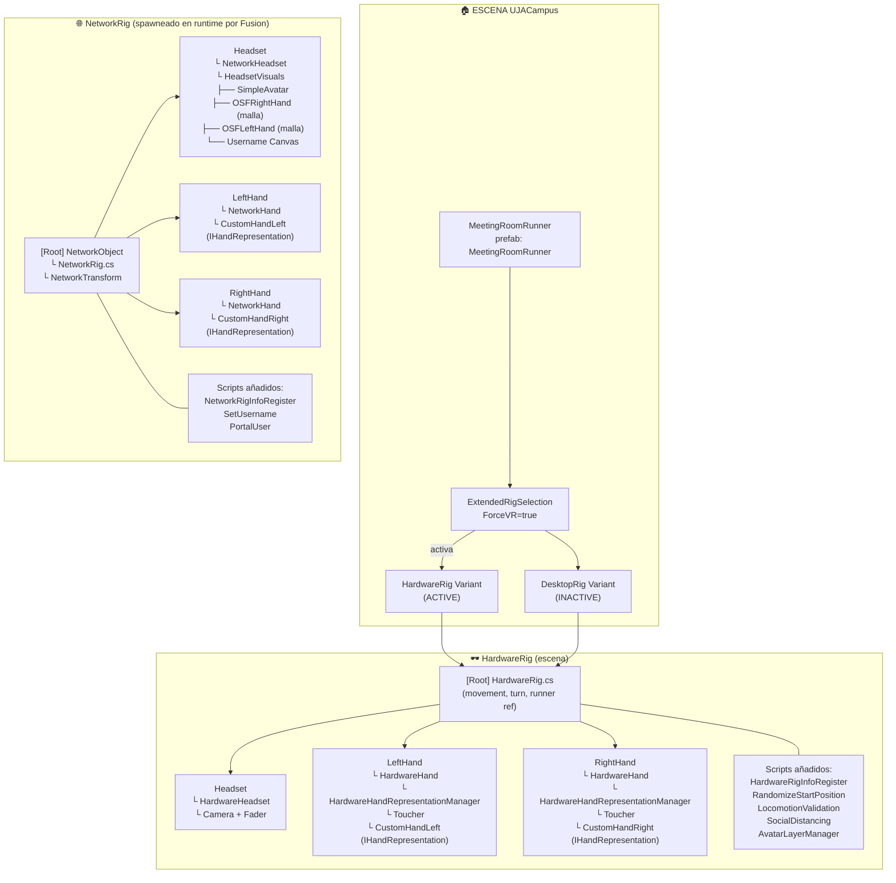

# XR Architecture — UJACampus

## 1. Diagrama de Componentes — Jerarquía de Prefabs

Relación "contiene a" entre GameObjects y scripts dentro del rig.



---

## 2. Diagrama de Secuencia — Arranque XR

Flujo desde que carga la escena hasta que el jugador aparece con manos.

```mermaid
sequenceDiagram
    actor User
    participant Scene as UJACampus Scene
    participant ExtSel as ExtendedRigSelection
    participant HwRig as HardwareRig
    participant RigInfo as RigInfo (singleton)
    participant ConnMgr as ConnectionManager
    participant Fusion as Fusion NetworkRunner
    participant NetRig as NetworkRig (spawneado)
    participant NetHand as NetworkHand

    Note over Scene: La escena carga con<br/>HardwareRig (active) y DesktopRig (inactive)

    Scene->>ExtSel: Awake()
    Note over ExtSel: selectionMode = ForceVR

    ExtSel->>HwRig: Activa HardwareRig<br/>(VR forzado)
    ExtSel->>ConnMgr: Activa ConnectionManager

    HwRig->>RigInfo: HardwareRigInfoRegister<br/>→ RegisterHardwareRig()
    Note over RigInfo: Guarda referencia<br/>al HardwareRig

    ConnMgr->>Fusion: StartGame(args)
    Fusion-->>Fusion: Conexión a sesión Fusion...

    Note over Fusion: OnPlayerJoined(player)

    ConnMgr->>Fusion: Spawn(MeetingRoomNetworkRig,<br/>position, rotation, player)
    Fusion-->>NetRig: Instancia el NetworkRig<br/>en la red

    NetRig->>NetRig: Spawned()
    NetRig->>HwRig: FindObjectOfType&lt;HardwareRig&gt;()
    NetRig->>RigInfo: NetworkRigInfoRegister<br/>→ RegisterNetworkRig()

    Note over NetRig,HwRig: 🔁 Runtime Loop

    loop Cada FixedUpdateNetwork
        HwRig->>NetRig: HardwareRig.RigState<br/>(posición cabeza + manos)
        NetRig->>NetHand: Sincroniza HandCommand<br/>(thumb, index, grip, trigger)<br/>vía [Networked]
        NetHand->>Fusion: Propaga a otros clientes
    end

    loop Cada Render
        NetRig->>NetRig: Extrapola posición local<br/>(mínima latencia)
    end

    Note over User: ✅ Jugador visible con manos<br/>y avatar en todos los clientes
```

---

## Referencias de Código

| Script | Ruta |
|---|---|
| `ConnectionManager.cs` | `Assets/ThirdParty/Photon/FusionAddons/XRShared/Scripts/` |
| `NetworkRig.cs` | `Assets/ThirdParty/Photon/FusionAddons/XRShared/Scripts/` |
| `HardwareRig.cs` | `Assets/ThirdParty/Photon/FusionAddons/XRShared/Scripts/` |
| `HardwareHand.cs` | `Assets/ThirdParty/Photon/FusionAddons/XRShared/Scripts/` |
| `NetworkHand.cs` | `Assets/ThirdParty/Photon/FusionAddons/XRShared/Scripts/` |
| `RigInfo.cs` | `Assets/_Project/Features/XR/Rigs/Scripts/` |
| `HardwareRigInfoRegister.cs` | `Assets/_Project/Features/XR/Rigs/Scripts/` |
| `NetworkRigInfoRegister.cs` | `Assets/_Project/Features/XR/Rigs/Scripts/` |
| `ExtendedRigSelection` | `Assets/ThirdParty/Photon/FusionAddons/XRShared/Prefabs/` |

## Prefabs Clave

| Prefab | Ruta |
|---|---|
| MeetingRoomRunner | `Assets/_Project/Spaces/Common/Prefabs/MeetingRoomRunner.prefab` |
| HardwareRig Variant | `Assets/_Project/Features/XR/Rigs/Prefabs/HardwareRig Variant.prefab` |
| NetworkRig Variant | `Assets/_Project/Features/XR/Rigs/Prefabs/NetworkRig Variant.prefab` |
| DesktopRig Variant | `Assets/_Project/Features/XR/Rigs/Prefabs/DesktopRig Variant.prefab` |
| MeetingRoomNetworkRig | `Assets/_Project/Spaces/Common/Prefabs/MeetingRoomNetworkRig.prefab` |
```

<｜｜DSML｜｜parameter name="explanation" string="true">This is a documentation file with two Mermaid diagrams: a component hierarchy diagram and a sequence diagram showing the XR startup flow in the UJACampus scene.